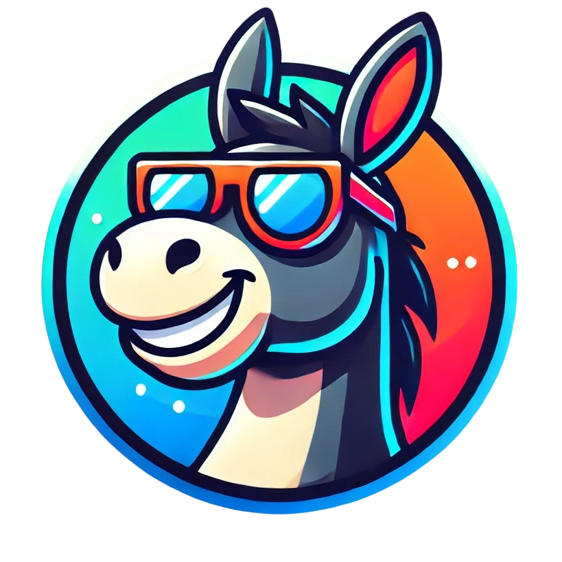

# Format Tokenizer

A data-driven token efficiency comparison tool for JSON, TOON, YAML, and XML serialization formats. Built to demonstrate that **compact JSON delivers nearly identical token savings to exotic formats** like TOON, while remaining a format LLMs are already trained to understand.

**🎮 [Try it live at toon.donkeywork.dev](https://toon.donkeywork.dev)**



## 🎯 Purpose

This application debunks social media hype around proprietary serialization formats by providing real-time, visual token count comparisons across **three major AI providers** (OpenAI, Anthropic, Google). Test with your own data and see the truth: compact JSON is efficient, familiar, and sufficient.

## ✨ Features

- **Multi-Provider Token Counting**:
  - OpenAI (o200k_base encoding via `gpt-tokenizer`)
  - Anthropic (configurable model selection via backend API)
  - Google (configurable model selection via backend API)
- **Five Format Comparison**: JSON (pretty & compact), TOON, YAML, and XML
- **Visual Tokenization**: Color-coded token breakdown with interactive tooltips
- **Interactive Bar Chart**: Horizontal bar chart comparing all formats across providers, sorted by efficiency
- **Fully Responsive**:
  - Desktop (>1200px): 4-column output layout
  - Tablet (768px-1200px): 2x2 grid output layout
  - Mobile (<768px): Vertical stack with proper scrolling
- **Example Data**: Quick-load Simple and Advanced JSON examples
- **Dark/Light Theme**: Toggle between Material Design Indigo dark and light themes (defaults to dark)
- **Copy to Clipboard**: Easy export of any format
- **Skeleton Loaders**: Visual feedback during API calls

## 🚀 Quick Start

### Local Development

```bash
# Install dependencies
npm install

# Run dev server
npm run dev

# Build for production
npm run build
```

### Docker Deployment

1. **Set up environment variables**:
```bash
# Copy the example env file
cp .env.example .env

# Edit .env and add your API keys
# ANTHROPIC_API_KEY=your_actual_anthropic_key
# GOOGLE_API_KEY=your_actual_google_key
```

2. **Build and run**:
```bash
# Build and run with Docker Compose
docker compose up -d

# Access at http://localhost:8081
```

Or pull from registry:
```bash
docker pull 192.168.0.140:8443/toon-token:latest
```

**Note**: The backend API requires valid Anthropic and Google API keys to function. You can get:
- Anthropic API key at: https://console.anthropic.com/
- Google API key at: https://aistudio.google.com/app/apikey

## 🏗️ Tech Stack

- **Framework**: React 19 + TypeScript + Vite
- **UI Library**: PrimeReact (Material Design Indigo theme)
- **Token Counting**:
  - Client-side: `gpt-tokenizer` (o200k_base)
  - Backend API: Anthropic and Google tokenizers
- **Format Libraries**:
  - `@toon-format/toon` - TOON encoding
  - `js-yaml` - YAML serialization
  - `js2xmlparser` - XML serialization
- **Charts**: Chart.js via PrimeReact
- **Deployment**: Docker (multi-stage build with nginx)

## 📊 How It Works

1. **Input**: Enter or load JSON data
2. **Parse**: Application validates and converts to all formats
3. **Tokenize**: Each format is tokenized using GPT's o200k_base encoding
4. **Compare**: View token counts, percentages, and visual breakdowns
5. **Analyze**: See that compact JSON is nearly as efficient as TOON

## 🎨 UI Components

### Component Architecture
The application is built with modular, reusable React components:
- **Header**: Logo, theme toggle, GitHub link, and About button
- **JsonInputPanel**: JSON input with example loaders and format button
- **OutputPanel**: Reusable panel for all output formats with token visualization
- **TokenChart**: Interactive horizontal bar chart with model selection
- **AboutDialog**: Project information modal
- **TokenDisplay**: Token visualization with color-coding

### Layout
- **Top Row**: JSON Input (left) | Token Chart (right)
- **Bottom Row**: JSON Output | TOON Output | YAML Output | XML Output

### Token Visualization
- Color-coded token breakdown (12-color palette)
- Hover tooltips show token ID and text
- Different color palettes for light/dark mode (Material Design variants)

### Interactive Chart
- Horizontal bar chart comparing all formats
- Model selection dropdowns for Anthropic and Google
- Formats sorted by efficiency (smallest to largest average tokens)
- Skeleton loaders during API calls
- Dark mode optimized with proper contrast

## 📱 Responsive Design

Three breakpoints for optimal viewing:
- **Desktop (>1200px)**: 4-column output layout
- **Tablet (768px-1200px)**: 2x2 grid output layout
- **Mobile (<768px)**:
  - Full vertical stack layout
  - Single column for all outputs
  - Scrollable content with proper overflow handling
  - Minimum heights to prevent content squeezing
  - Chart gets 450px minimum height

## 🐳 Docker Configuration

Multi-stage build:
1. **Builder Stage**: Node 20 Alpine - installs deps and builds
2. **Production Stage**: Nginx Alpine - serves static files

```dockerfile
# Build
FROM node:20-alpine AS builder
WORKDIR /app
COPY package*.json ./
RUN npm ci
COPY . .
RUN npm run build

# Serve
FROM nginx:alpine
COPY --from=builder /app/dist /usr/share/nginx/html
EXPOSE 80
```

## 🔧 Configuration

### Default Settings
- **Initial Data**: Advanced glossary example
- **Output Format**: Compact JSON (demonstrates efficiency)
- **Theme**: Dark mode (md-dark-indigo)
- **Tokenization View**: Always enabled with color-coded display

### Environment
- Port: 8081 (Docker Compose)
- Build Output: `dist/`
- Assets: `src/assets/`

## 📦 Project Structure

```
src/
├── App.tsx              # Main application logic and state
├── App.css             # Responsive styles (mobile/tablet/desktop)
├── index.css           # Global styles, PrimeReact imports
├── main.tsx            # Entry point
├── api/
│   ├── index.ts        # API exports
│   ├── client.ts       # Backend API calls
│   └── types.ts        # TypeScript interfaces
├── components/
│   ├── Header.tsx      # App header with actions
│   ├── JsonInputPanel.tsx  # JSON input editor
│   ├── OutputPanel.tsx     # Reusable output display
│   ├── TokenChart.tsx      # Chart with model selection
│   ├── AboutDialog.tsx     # About modal
│   └── TokenDisplay.tsx    # Token visualization
└── assets/
    ├── donkeywork.png  # Logo
    └── favicon.ico     # Favicon

public/              # Static assets
index.html          # HTML entry with dynamic theme link
Dockerfile          # Multi-stage build
docker-compose.yml  # Docker Compose configuration
CLAUDE.md           # Detailed project documentation
```

## 🤝 Contributing

This project demonstrates a specific thesis: compact JSON is efficient. Contributions that enhance the comparison or improve the user experience are welcome.

## 📄 License

MIT

## 👤 Author

**Andrew Morgan**
AI Engineer at [Airia](https://airia.com)
- LinkedIn: [andrewjmorgan](https://www.linkedin.com/in/andrewjmorgan/)
- GitHub: [andyjmorgan](https://github.com/andyjmorgan)

## 🙏 Acknowledgments

Built with:
- [PrimeReact](https://primereact.org/) - UI component library
- [@toon-format/toon](https://www.npmjs.com/package/@toon-format/toon) - TOON encoding
- [gpt-tokenizer](https://www.npmjs.com/package/gpt-tokenizer) - Token counting
- [js-yaml](https://www.npmjs.com/package/js-yaml) - YAML serialization

---

**Real talk**: If social media "experts" are hyping exotic formats while ignoring the simplicity of JSON compact, they're talking out their ass. Test it yourself—the data doesn't lie.
